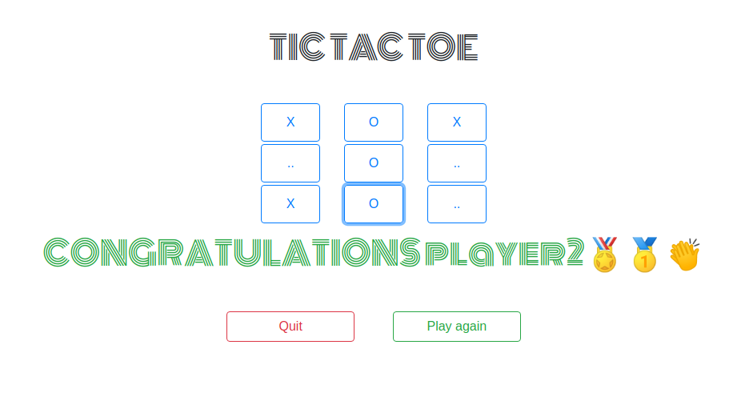
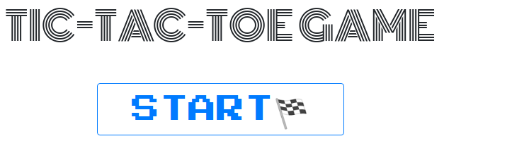
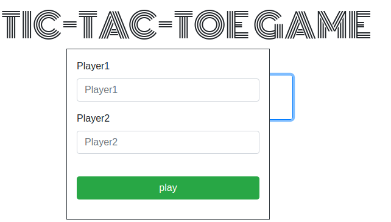
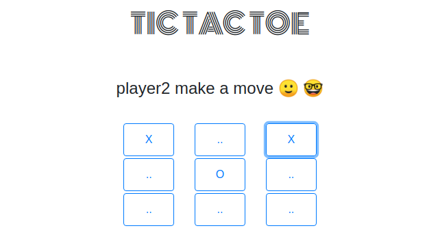
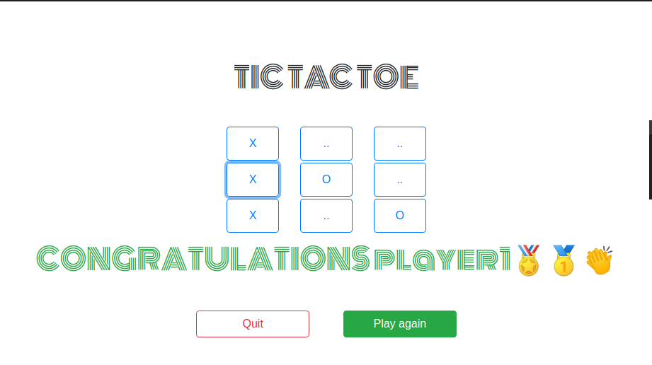
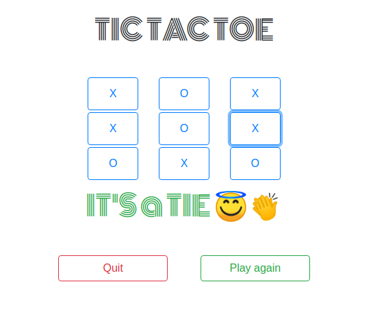

# Tic-Tac-Toe-Js

This is an implementation of the Tic tac toe game in javascript. You can play this game in your browser.

Tic tac toe is a game in which two players seek in alternate turns to complete a row, a column, or a diagonal with either three O's or three X's drawn in the spaces of a grid of nine squares; noughts and crosses. 

This is part of the [Ordin projects](https://www.theodinproject.com/courses/javascript/lessons/tic-tac-toe-javascript) from the [microverse](https://www.microverse.org/)  curriculum.

## Live link
[Tic Tac Toe](https://raw.githack.com/Tresor11/Tic-Tac-Toe-Js/features/index.html)

## How to play the game
- Once you navigate to the home page, Click on the start button

- A form will pop up prompting you to enter your name. Please enter your name or else the game will by default give you names _PlayerOne_ and _PlayerTwo_

- The game instructions will change per each member's turn and name prompting you to take position on the board. The first player takes *X* and they next player takes *O* mark on the board

- The game ends when one of the players gets all his X's or O's in a row, column or diagonal and a congraturatory message is sent to him with his name. The game also ends in a draw if none of the players
has their X's or O's in a line and the board is full.

- For a draw

- You can play again by clicking on the *Play Again* button or *Quit*

## Prerequisites
To comfortably use this project, prior knowledge of the following is ideal
- Html and Css
- Javascript
- Eslint
- Bootstrap 4

### Setup
Run 
~~~ 
git clone https://github.com/Tresor11/Tic-Tac-Toe-Js/tree/features 
~~~
to clone this project to your local machine and you are good to go.

👤 **Tresor**

- Github: [@Tresor11](https://github.com/Tresor11)

👤 **Phemia**

- Github: [@ampaire](https://github.com/ampaire)
- Twitter: [@AmpaPhem](https://twitter.com/AmpaPhem)
- Linkedin: [linkedin](https://linkedin.com/ampaire-phemia)

## 🤝 Contributing

Contributions, issues and feature requests are welcome!

Feel free to check the [issues page](https://github.com/Tresor11/Tic-Tac-Toe-Js/issues).

## Show your support

Give a ⭐️ if you like this project!

## Acknowledgments
- [Ordin](https://www.theodinproject.com/courses/javascript/lessons/tic-tac-toe-javascript)
- [Sololearn](https://www.sololearn.com/Play/JavaScript)